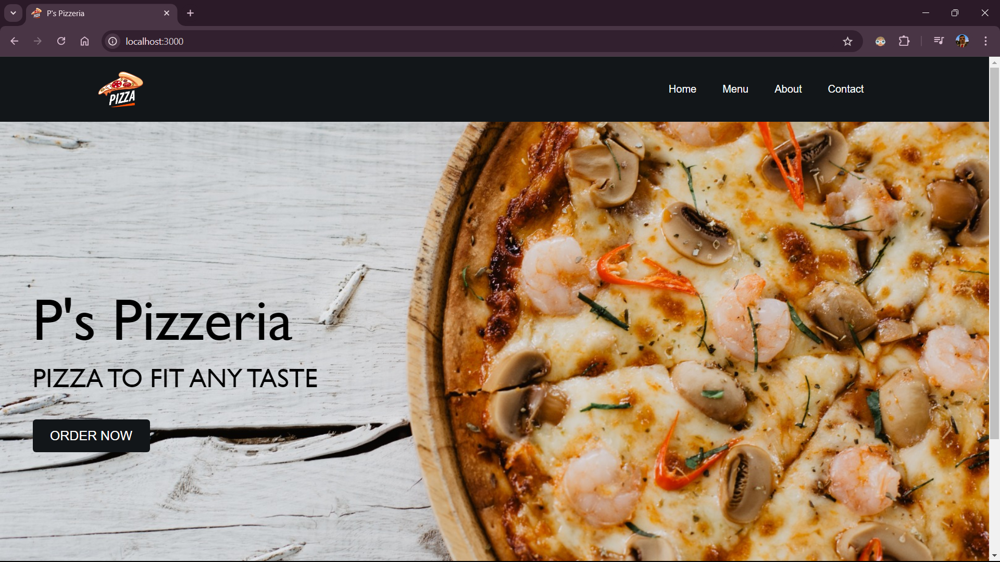
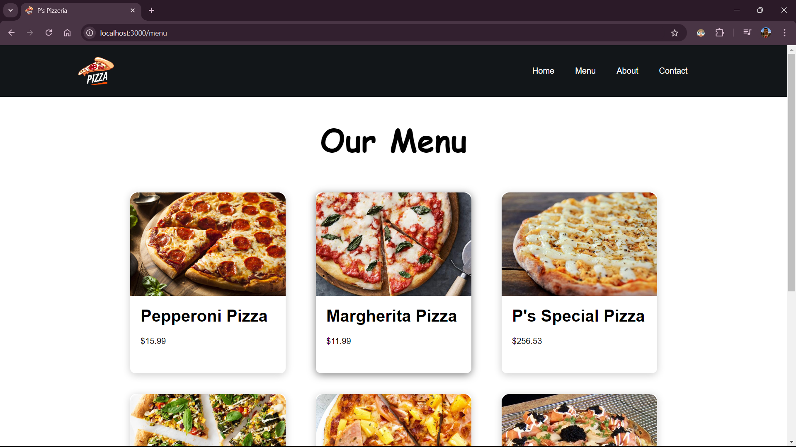
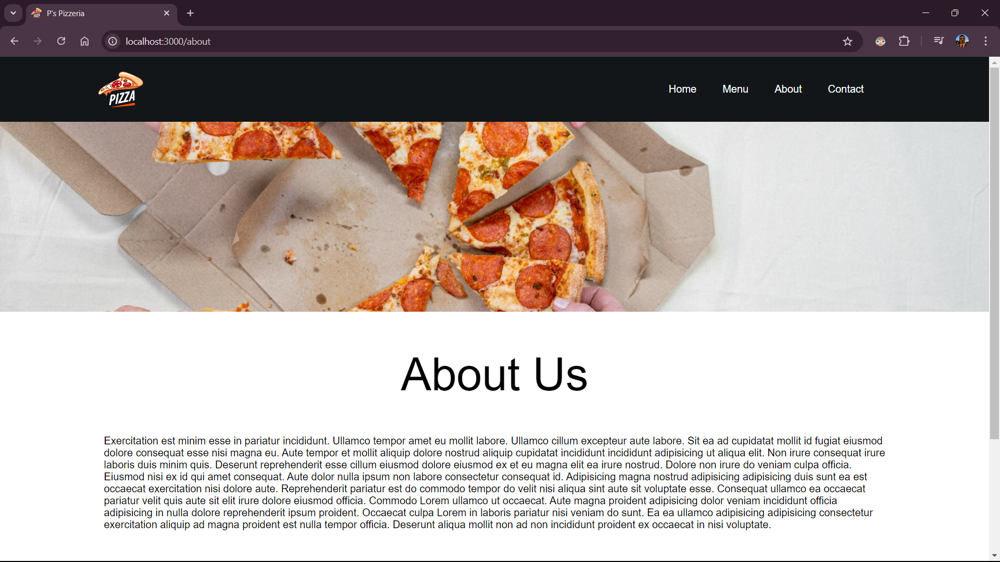
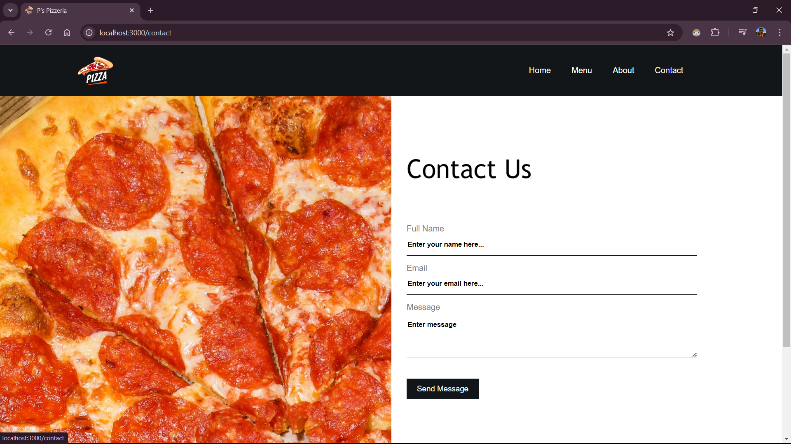

# P's Pizzeria 🍕

This project is a simple pizza restaurant website built using ReactJS. It was developed as a practice project to improve my skills in ReactJS and web development. The website features a modern and responsive design, allowing users to explore the restaurant menu.


## Tech Stack

- **Frontend:** ReactJS
- **Styling:** CSS
- **Icons:** Material UI
- **State Management:** React Hooks (useState)

  
## Installation

To run this project locally, follow these steps:

1. **Clone the repository:**
   ```bash
   git clone https://github.com/promishgrg98/pizzeria.git
2. **Navigate to the project directory:**
   ```bash
   cd pizzeria
3. **Install the dependencies:**
   ```bash
   npm install
4. **Start the development server:**
   ```bash
   npm start
The application will be available at http://localhost:3000.


## Screenshots

### Home Page


### Menu Page


### About Page


### Contact Page

